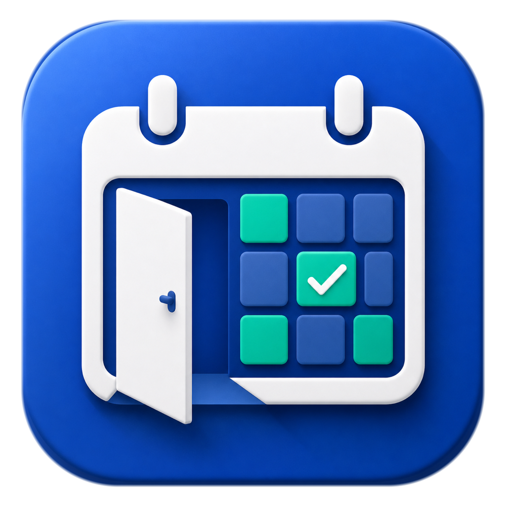
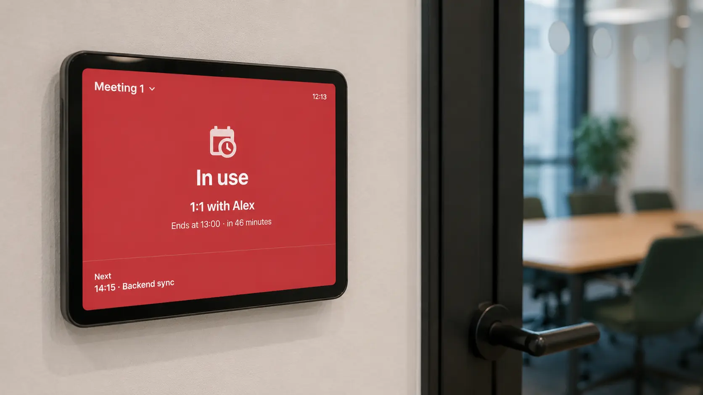
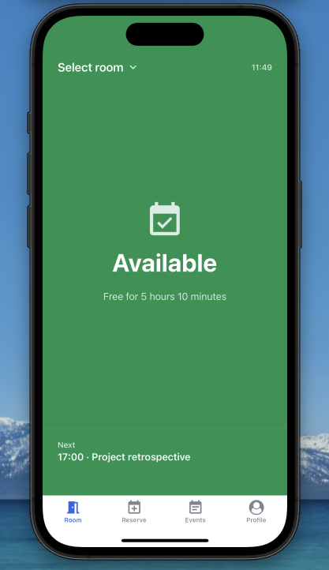
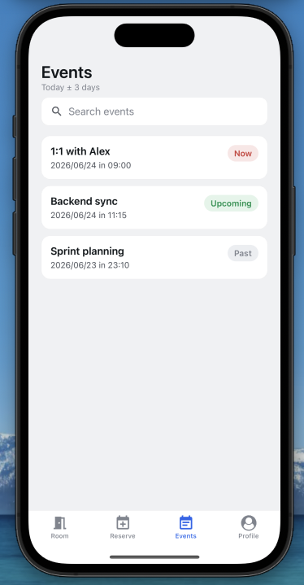
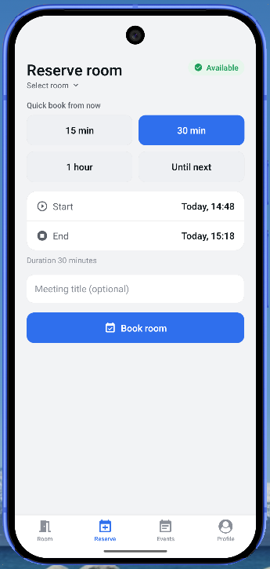

<h1>
  <sub></sub>
  MeetBoard
</h1>



---

MeetBoard is an **iOS & Android app** that turns any device into a meeting-room door display. It shows whether the room is **Available** or **In use**, synced live with Google Calendar — no server, no backend, no database. The app talks directly to the **Google Calendar REST API** using OAuth tokens stored on the device.

Each conference room is a separate Google Calendar on one account. Pick a room from the list and the board displays its live status, current meeting, time remaining, and what's up next. Switch rooms any time from the app.

> **No backend.** State lives entirely on-device — session and preferences in AsyncStorage, calendar data cached by TanStack Query. Google Calendar is the single source of truth.

---

## Screenshots

<div align="center">
  
  
  
</div>

---

## Features

- **Room board** — full-screen Available / In use display, color-coded for a glance from across the hallway. Shows the current meeting, countdown, and next event.
- **Multi-room** — each room is a separate Google Calendar. Switch rooms from the picker; the board auto-refreshes.
- **Reserve** — quick-book (15 min / 30 min / 1 h / until next meeting) or pick a custom time range with an optional title.
- **Events** — searchable agenda list with Now / Upcoming / Past status chips and pull-to-refresh.
- **Google Sign-In** — native OAuth on iOS & Android (`@react-native-google-signin`), browser flow on web. Silent token refresh, no server needed.
- **Light / dark / system** theme, persisted across restarts.

---

## Tech stack

| Layer         | Library                                               | Version |
| ------------- | ----------------------------------------------------- | ------- |
| Framework     | Expo SDK                                              | 56      |
| Runtime       | React Native                                          | 0.85    |
| Language      | TypeScript                                            | strict  |
| Navigation    | React Navigation native-stack + bottom-tabs           | v7      |
| Server state  | TanStack Query                                        | v5      |
| Client state  | Zustand + persist                                     | v5      |
| Auth (native) | `@react-native-google-signin/google-signin`           | —       |
| Auth (web)    | `expo-auth-session` Google provider                   | —       |
| Offline cache | `@tanstack/react-query-persist-client` + AsyncStorage | —       |
| Dates         | dayjs                                                 | —       |

---

## Getting started

```bash
npm install
npm start
```

Press `w` for web, `i` for iOS simulator, or `a` for Android emulator. Without Google credentials the app launches in **mock-login mode** — full UI, no Google calls.

---

## Google OAuth setup

1. In [Google Cloud Console](https://console.cloud.google.com/) enable the **Google Calendar API**.
2. Configure the **OAuth consent screen** (External / Testing). Add scopes:
   - `openid`, `email`, `profile`
   - `https://www.googleapis.com/auth/calendar`
   - Add your account under **Test users**.
3. Create OAuth client IDs under **Credentials**:
   - **Web** — add `http://localhost:8081` to Authorized JavaScript origins and redirect URIs.
   - **iOS** — bundle ID `com.meetboard.app`.
   - **Android** — package `com.meetboard.app` + SHA-1 from `~/.android/debug.keystore`.
4. Copy `.env.example` → `.env` and fill in the values:

```bash
cp .env.example .env
```

```env
EXPO_PUBLIC_GOOGLE_WEB_CLIENT_ID=
EXPO_PUBLIC_GOOGLE_IOS_CLIENT_ID=
EXPO_PUBLIC_GOOGLE_ANDROID_CLIENT_ID=
EXPO_PUBLIC_GOOGLE_WEB_CLIENT_SECRET=   # web token refresh only, dev-only
```

5. Restart with a cleared cache:

```bash
npx expo start -c
```

When at least one client ID is present, the login button uses real Google OAuth.

---

## Native builds (iOS / Android)

Google Sign-In on native requires a **development build** — Expo Go cannot host the native SDK:

```bash
npx expo prebuild --clean
npx expo run:ios       # or: npx expo run:android
```

> After `--clean` on Android, recreate `android/local.properties` with `sdk.dir=/path/to/Android/sdk` if Gradle can't find the SDK.

---

## Scripts

| Command             | Description                     |
| ------------------- | ------------------------------- |
| `npm start`         | Expo dev server (all platforms) |
| `npm run web`       | Open in browser                 |
| `npm run typecheck` | TypeScript — `tsc --noEmit`     |
| `npm test`          | Jest unit tests                 |
| `npm run lint`      | ESLint                          |
| `npm run format`    | Prettier write                  |

---

## Project structure

```
src/
  App.tsx                  entry; fonts, store hydration, providers
  api/
    googleCalendar.ts      Google Calendar REST wrappers
    queries.ts             TanStack Query hooks
  components/
    ui.tsx                 Screen, Card, AppText, AppButton, Chip, Divider
    DateTimePicker.tsx     cross-platform date/time picker
    Toast.tsx              imperative toast
    ErrorBoundary.tsx      class component, wraps navigator
  hooks/
    useGoogleAuth.ts       native Google Sign-In
    useGoogleAuth.web.ts   web OAuth via expo-auth-session
  lib/
    eventUtils.ts          pure date helpers
    googleAuth.ts          ensureFreshAccessToken()
    googleSignOut.ts       sign-out (native / web)
    queryClient.ts         QueryClient + AsyncStorage persister
  navigation/
    RootNavigator.tsx      Login / Main / RoomPicker
    MainTabNavigator.tsx   Room / Reserve / Events / Profile tabs
  screens/
    LoginScreen.tsx
    RoomPickerScreen.tsx
    CurrentEventScreen.tsx
    main/  StatusScreen · PlannerScreen · EventsScreen · UserScreen
  store/
    useSessionStore.ts     user, tokens, expiry
    useRoomStore.ts        selected room
    usePreferencesStore.ts theme, kiosk mode
  theme/
    useAppTheme.ts         light/dark palette hook
```
